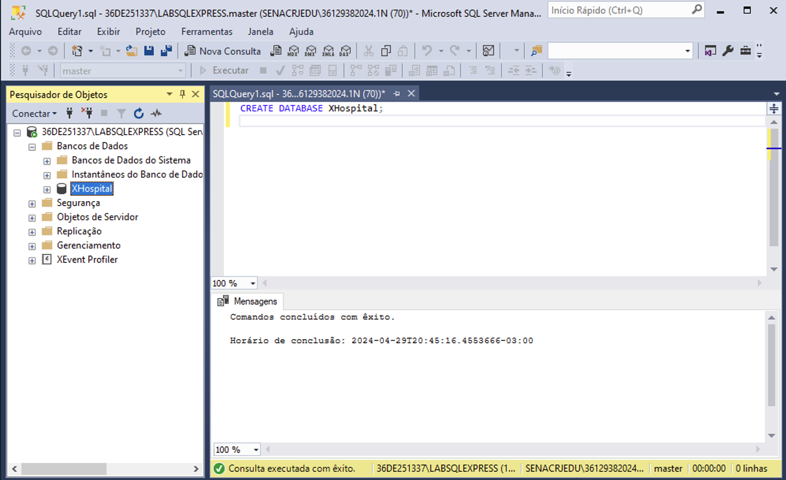
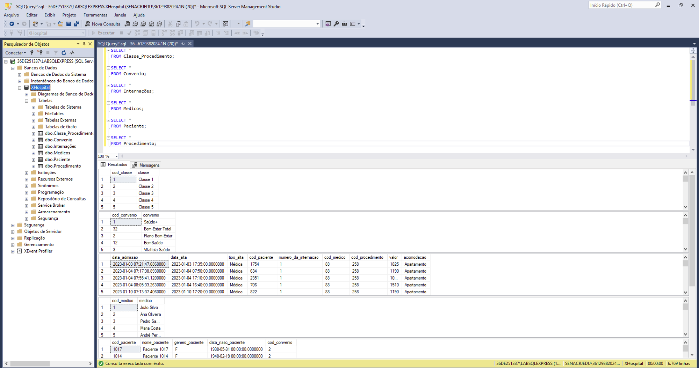

# Projeto de Análise Hospitalar (SQL+Power-BI)

# Introdução

O objetivo deste projeto foi de adquirir experiência com Bancos de Dados, através da linguagem SQL, tendo como produto final um Dashboard criado no Power BI. Neste projeto, somos livres para escolher qual SGBD será utilizado para executar o problema. Neste caso, o escolhido foi o **SQL Server**.

# Contexto

O XHospital está precisando dos nossos serviços como Analistas de Dados. Toda operação hospitalar é feita através de um ERP que utiliza como base de dados um banco SQL.

Esse sistema contempla um módulo que gera relatórios, mas como de costume, são relatórios limitados e extrair real valor deles não é uma tarefa fácil.

Os diretores do XHospital **precisam avaliar o setor de internação** e, muito melhor do que páginas e páginas de relatórios, querem um Dashboard dinâmico para fazer essa análise.

O setor de TI te dará acesso à base de dados, mas tem um detalhe: esse setor está desfalcado. Parte da equipe está de férias e um colaborador não faz mais parte da equipe. Isso significa que o setor está bem sobrecarregado e nós, como bons Analistas de Dados, precisaremos **desenvolver as queries SQL** necessárias para fazer o projeto acontecer.

# Perguntas
Criaremos um dashboard que responda perguntas como:

- **Qual o número de Admissões? E a quantidade de altas?**
- **Qual a taxa de mortalidade?**
- **Qual é o TMP (Tempo Médio de Permanência) dos pacientes?**
- **Quais convênios nos geram maior faturamento?**
- **Quais as classes de procedimentos que mais realizamos na unidade?**

# Coleta e Tratamento dos Dados através do SQL

O dataset será formado por 6 tabelas, sendo elas:

_1. tab_classe_procedimento.csv_

_2. tab_convenio.csv_

_3. tab_internacoes.csv_

_4. tab_medicos.csv_

_5. tab_paciente.csv_

_6. tab_procedimento.csv_

Abaixo o detalhamento de cada uma das tabelas:

1. Começaremos criando uma database no SQL Server chamado ‘XHospital’.

2. Vamos importar os arquivos csv com o Assistente de Importação de Arquivo Simples

3. Repetiremos o processo com as outras 5 tabelas csv até que todas estejam dentro da database ‘XHospital’.

4. Através do comando JOIN vamos juntar tabelas que contém colunas semelhantes seguindo o esquema abaixo:

5. Com a base agrupada pronta, podemos então exportá-la (no formato csv) para ser trabalhada no Power BI.

# Utilizando o Power BI para visualizar os Dados

Com o dashboard pronto, podemos então chegar as seguintes conclusões:

- **Qual o número de Admissões? E a quantidade de altas?**

_XHospital registrou um número de 3.461 admissões ao longo do tempo. 2.806 em 2023 e 655 em 2024 (até Março). Sendo Agosto e Janeiro os meses com os maiores picos em 2023 e 2024, respectivamente._

_Já no que se refere as Altas, a XHospital registrou um número de 2.806 em 2023 e 631 no primeiro trimestre de 2024._

- **Qual a taxa de mortalidade?**

_A XHospital registrou uma taxa de mortalidade de 3,64% em 2023 e 4,73% no primeiro trimestre de 2024._

- **Qual é o TMP (Tempo Médio de Permanência) dos pacientes?**

_O Tempo Médio de Permanência em 2023 foi de 5 dias, enquanto que em 2024 registra 4 dias._

- **Quais convênios nos geram maior faturamento?**

_Os 5 convênios de maior faturamento, em ordem decrescente, são: Vitalícia Saúde, Plano Vida Nova, Saúde Premier, Plano Bem-Estar e Viva Mais Saúde._

- **Quais as classes de procedimentos que mais realizamos na unidade?**

_As duas principais classes de procedimentos são as classes 19 e 1._

Essas são algumas perguntas que os diretores gostariam de responder, mas como bons Analistas de Dados, **iremos nos desafiar a trazer novos insights** para o hospital.

Por exemplo, podemos identificar que o maior número de pacientes que são atendidos pela XHospital encontram-se na faixa etária de 18 a 64 anos (Adultos) seguidos por aqueles de 65 anos ou mais (Idosos).

Também podemos observar que as mulheres representam a maioria dos pacientes e que o tipo de acomodação mais utilizado no XHospital é o apartamento, seguido então pela enfermaria.

Por meio dessas informações disponíveis no dashboard criado por nós, os diretores da XHospital poderão tomar suas decisões de maneira mais embasadas e acertivas.
